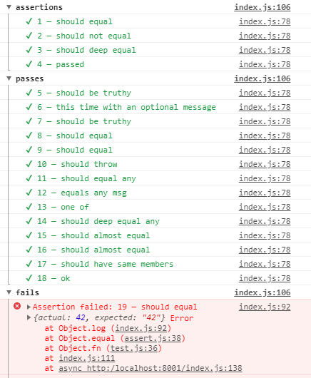

# tst

Test without <em>e</em>fforts.

* tape API
* no tooling, vanilla ESM
* async functions support
* inspectable errors
* correct stacktrace with sourcemaps
* good l&f in browser/node
* supports [assert](https://www.npmjs.com/package/assert), [chai](https://www.npmjs.com/package/chai) etc.
* tiny bundle, 0dep

## usage

```js
import test, { ok, is, not, throws } from 'tst.js'

test('pass', () => {
	ok(true);
	ok(true, 'this time with an optional message');
	ok('not true, but truthy enough');

	is(1 + 1, 2);
	is(Math.max(1, 2, 3), 3);
	is({}, {})

	throws(() => {
		throw new Error('oh no!');
	}, /oh no!/);
})

test('fail', () => {
	is(42, '42');
	is({}, {x:1});
})
```

Creates output in console:



## api

* `test.skip` − bypass test, mutes output
* `test.only` − run only the indicated test, can be multiple
* `test.todo` − bypass test, indicate WIP sign
* `test.demo` − demo run, skips failed assertions.

## assert

* `ok(a, msg?)` − generic truthfulness assert
* `is(a, b, msg?)` − assert with `Object.is` for primitives and `deepEqual` for objects
* `not(a, b, msg?)` - assert with `!Object.is` for primitives and `!deepEqual` for objects
* `any(a, [a, b, c], msg?)` − assert with optional results
* `almost(a, b, eps, msg?)` − assert approximate value/array
* `same(listA, listB, msg?)` − assert same members of a list/set/map/object
* `throws(fn, msg?)` − fn must throw
* `pass(msg)`, `fail(msf)` − pass or fail the whole test.

## why?

Testing should not involve maintaining test runner.<br/>
It should be simple as [tap/tape](https://ghub.io/tape), working in browser/node, ESM, with nice l&f, done in a straightforward way.<br/>
I wasn't able to find such test runner that so I had to create one.

### similar

* [uvu](https://github.com/lukeed/uvu)
* [tape-modern](https://ghub.io/tape-modern)
* [@goto-bus-stop/tape-modern](https://github.com/goto-bus-stop/tape-modern#readme)
* [brittle](https://github.com/davidmarkclements/brittle)

<p align="center"><a href="https://github.com/krishnized/license">🕉️</a></p>
